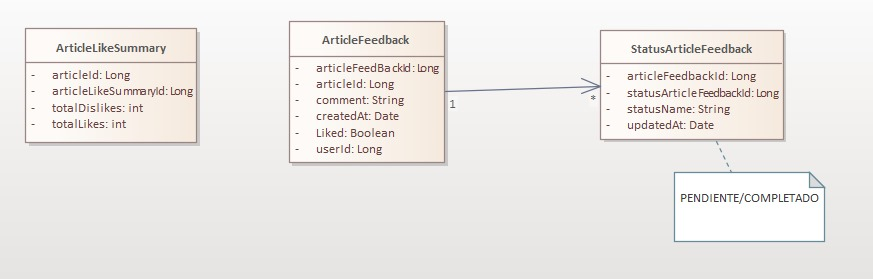

### Acerca de ArticleFeedbackMS Beta
Microservicio presentado como caso de estudio para el e-commerce de la cátedra de Arquitectura de microservicios.

Se encarga de darle la posiblidad al usuario de brindar un feedback, con comentario y like/dislike a los artículos que compró.
Permite además consultar una lista de _Feedbacks pendientes_ para completarlos posteriormente.
Permite a los usuarios poder consultar las experiencias de otros con un artículo específico, además de poder consultar todos los feedbacks realizados por un usuario.

#### MongoDB
La base de datos del microservicio es almacenada en MongoDB

#### Estructura de Datos




_ArticleFeedback_
- articleFeedbackId: Long
- userId: Long
- articleId: Long
- statusArticleFeedbackId: Long
- comment: String
- liked: boolean
- createdAt: Date

_StatusArticleFeedback_
- articleFeedbackId: Long
- updatedAt: Date
- statusName: String

_ArticleLikeSummary_
- articleId: Long
- totalLikes: int
- totalDislikes: int


#### Conexiones a otros Microservicios - RabbitMQ
Este microservicio se comunica con los demás del ecosistema del e-commerce a través de Rabbit.

- Order_placed (servicio de catálogo)
ArticleFeedbackMS escucha el mensaje "order_placed" de catálogo para posteriormente crear un ArticleFeedback con estado "pendiente".

#### Casos de Uso de ArticleFeedback
- **CU: Crear Feedback de un Artículo**
  
**Descripción:** Cuando una orden es completada, se crea de manera automática, un ArticleFeedback relacionado al articulo y al usuario de la orden, en estado PENDIENTE.

**Precondición:** El evento order_placed ha sido emitido y contiene _userId y ArticleId_

**Entradas:** Información extraída de order_placed

**Salida:** El feedback se almacena y se asocia con el artículo, el usuario y un estadoArticleFeedback inicializado en PENDIENTE.

**Camino Normal:**
1. El sistem escucha el evento order_placed
2. Se extraen userId y articleId del evento
3. Se crea un nuevo ArticleFeedback con statusArticleFeedback en PENDIENTE, con el articleId y userId de la orden que se recibió.

**Camino Alternativo:**

- **CU: Listar ArticleFeedbacks con estado pendiente.**

**Descripción:** Permite a un usuario listar sus ArticleFeedback que no han sido completados.

**Precondición:** El usuario debe estar autenticado.

**Entradas:** userId

**Salida:** Lista de ArticleFeedbacks con estado PENDIENTE.

**Camino Normal:**
1. El usuario envía una solicituda para ver feedbacks pendientes.
2. El microservicio consulta los ArticleFeedback del userId con statusArticleFeedback en PENDIENTE.
3. Se muestra la lista al usuario

**Camino Alternativo:**
- Si el usuario no tiene feedbacks pendientes, se devuelve una lista vacía.


- **CU: Llenar ArticleFeedback pendiente**

**Descripción:** Un usuario puede registrar un comentario y su valoración (like o dislike) en un articleFeedback con statusArticleFeedback PENDIENTE.

**Precondición:** El usuario debe estar autenticado, y el ArticleFeedback debe tener estadoArticleFeedback en PENDIENTE.

**Entradas:** articleFeedbackId, comment(string) , liked (boolean).

**Resultado:** El statusArticleFeedback cambia su statusName a COMPLETADO y se actualiza el campo updatedAt. Se dispara el _CU: Actualizar conteo de likes para un artículo_

**Camino Normal:**
1. El usuario envía los datos de comment y liked para un ArticleFeedback en PENDIENTE.
2. El microservicio cambia el statusName de statusArticleFeedback a COMPLETADO y actualiza updatedAt.
3. Se lanza el CU: Actualizar conteo de likes para un árticulo.

**Camino Alternativo:**
- Si el ArticleFeedback ya ha sido completado , el sistema rechaza la solicitud.

- **CU: Actualizar conteo de likes para un artículo**

**Descripción:** Después de coompletar un feedback, el sistema incrementa el total de likes/dislikes en ArticleLikeSummary.

**Precondición:** Un ArticleFeedback cambió su estado a COMPLETADO.

**Entradas:** liked (boolean), articuloId

**Resultado:** Se incrementa el valor de totalLikes o totalDislikes de la entidad ArticleLikeSummary asociada a dicho artículo, dependiendo del valor del booleano liked.

**Camino Normal:**
1. El sistema verifica si liked es true o false.
2. Se busca la entidad ArticleLikeSummary con articuloId igual al pasado por parámetro.
3. Si el valor de like es true, se incrementa el totalLikes, si es false el totalDislikes
5. Se almacena el nuevo conteo en la entidad ArticleLikeSummary.

**Camino Alternativo:**
- Si no se ecuentra un articleLikeSummary para ese articuloId, se crea uno nuevo.


- **CU: Listar ArticleFeedbacks por Artículo**

**Descripción:** Permite a el usuario consultar todos los comentarios realizados sobre un artículo específico.

**Precondición:** El usuario debe estar autenticado.

**Entradas:** articleId.

**Salida:** Lista de ArticleFeedback ascoiados a ese articleId, incluyendo _comment, liked, userId y updatedAt_ . 
DUDA(((Muestra también el _total de likes o dislikes de el articulo._)))

**Camino Normal:**
1. EL usuario solicita ver los ArticleFeedback de un artículo.
2. El microservicio busca todos los feedbacks con estado igual a COMPLETADO para el articleId correspondiente.
3. Se muestra la lista de feedbacks, **junto con el total de likes y dislikes**

**Camino Alternativo:**
- Si no existen feedbacks para el artículo, se devuelve una lista vacía

- **CU: Listar ArticleFeedbacks por Usuario**

**Descripción:** Permite a el usuario consultar todos los comentarios realizados sobre un artículo específico por un usuario específico.

**Precondición:** El usuario debe estar autenticado.

**Entradas:** articleId, userId

**Salida:** Lista de ArticleFeedback, creados por el _userId_ y asociados al _articleId__, incluyendo _comment, liked y updatedAt_

**Camino Normal:**
1. El usuario solicita vert los feedbacks por un usuario específico para un artículo.
2. El sistema busca todos los feedbacks que coincidan con userId y articleId, que tengan estado COMPLETADO.
3. Se muestra la lista de los feedbacks

**Camino Alternativo:**
- Si el usuario no ha creado feedbacks para el artículo, se devuevlve una lista vacía


### Interfaz REST

**Listar artículos pendientes de feedback**

`GET /v1/article-feedback/pending`

*Headers*

Authorization: Bearer token

userId: Id del usuario autenticado.

*Response*
`200 OK` si el usuario está autenticado
```json
[
  {
    "articleFeedbackId": "12345",
    "articleId": "56789",
    "userId": "101112",
    "status": "PENDIENTE",
    "createdAt": "2024-10-12T08:42:00Z"
  },
  ...
]
```

`401 UNAUTHORIZED` si el usuario no está autenticado

**Llenar ArticleFeedbacksPendientes**

`GET /v1/article-feedback/{articleFeedbackId}/fill`

*Headers*

Authorization: Bearer token

*Parámetro de ruta*

articleFeedbackId: ID del feedback a completar.

*Body*
```json
{
"comment": "string",
"liked": true
}
```

*Response*
`200 OK` Si el ArticleFeedback cambio su estado a COMPLETADO.
```json
{
  "articleFeedbackId": "12345",
  "articleId": "56789",
  "userId": "101112",
  "comment": "Un producto increíble",
  "liked": true,
  "statusArticleFeedback": {
    "status": "COMPLETADO",
    "updatedAt": "2024-10-12T08:45:00Z"
  }
}

```

`401 UNAUTHORIZED` si el usuario no está autenticado

**Listar articleFeedbacks por artículo**
`GET /v1/article-feedback`

*Headers*

Authorization: Bearer token

*Query Parameters (Opcional)*
- articleId (Long, opcional): ID del artículo para filtrar los feedbacks por artículo.

- userId (Long, opcional): ID del usuario para filtrar los feedbacks por usuario.

*Response*
`200 OK` si el usuario está autenticado.
```json
[
    {
      "articleFeedbackId": "12345",
      "articleId": "56789",
      "userId": "101112",
      "comment": "Increible producto",
      "liked": true,
      "createdAt": "2024-10-01T08:30:00Z",
      "updatedAt": "2024-10-12T08:45:00Z"
    },
    {
      "articleFeedbackId": "12346",
      "articleId": "56789",
      "userId": "101113",
      "comment": "Podría estar mejor",
      "liked": false,
      "createdAt": "2024-10-03T09:00:00Z",
      "updatedAt": "2024-10-13T10:00:00Z"
    }
  ]

```

`401 UNAUTHORIZED` si el usuario no está autenticado


