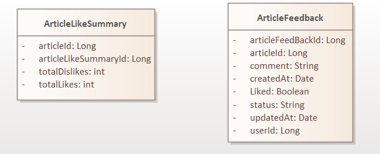

### Acerca de ArticleFeedbackMS Beta
Microservicio presentado como caso de estudio para el e-commerce de la cátedra de Arquitectura de microservicios.

Se encarga de darle la posiblidad al usuario de brindar un feedback, con comentario y like/dislike a los artículos que compró.
Permite además consultar una lista de _Feedbacks pendientes_ para completarlos posteriormente.
Permite a los usuarios poder consultar las experiencias de otros con un artículo específico, además de poder consultar todos los feedbacks realizados por un usuario.

#### MongoDB
La base de datos del microservicio es almacenada en MongoDB

#### Estructura de Datos




_ArticleFeedback_
- articleFeedbackId: Long
- userId: Long
- articleId: Long
- statusArticleFeedbackId: Long
- comment: String
- liked: boolean
- createdAt: Date
- updatedAt: Date
- status: String //PENDIENTE o COMPLETADO

_ArticleLikeSummary_
- articleId: Long
- totalLikes: int
- totalDislikes: int


#### Conexiones a otros Microservicios - RabbitMQ
Este microservicio se comunica con los demás del ecosistema del e-commerce a través de Rabbit.

- Order_placed (servicio de catálogo)
ArticleFeedbackMS escucha el mensaje "order_placed" de catálogo para posteriormente crear un ArticleFeedback con estado "pendiente".

- update_likes_queue para el conteo de likes/dislikes
ArticleFeedbackMS emite un mensaje a la cola update_likes_queue para que luego dicho evento actualice el conteo de likes y dislikes de un articulo de manera asincrónica con ArticleSummary para mantener una contabilización precisa de likes y dislikes para cada artículo.

#### Casos de Uso de ArticleFeedback
#### 1. **CU: Crear Feedback de un Artículo**
  
**Descripción:** Cuando una orden es completada, se crea de manera automática, un ArticleFeedback relacionado al articulo y al usuario de la orden, en estado PENDIENTE.

**Precondición:** El evento order_placed ha sido emitido y contiene _userId y ArticleId_

**Entradas:** Información extraída de order_placed

**Salida:** El feedback se almacena y se asocia con el artículo, el usuario, y se inicializa con status PENDIENTE.

**Camino Normal:**
1. El sistem escucha el evento order_placed
2. Se extraen userId y articleId del evento
3. Se crea un nuevo ArticleFeedback con status en PENDIENTE, con el articleId y userId de la orden que se recibió.

**Camino Alternativo:**

#### 2. CU: Consultar ArticleFeedbacks Pendientes.

**Descripción:** Permite a un usuario listar sus ArticleFeedback que no han sido completados.

**Precondición:** El usuario debe estar autenticado.

**Entradas:** userId

**Salida:** Lista de ArticleFeedbacks con estado PENDIENTE.

**Camino Normal:**
1. El usuario envía una solicituda para ver feedbacks pendientes.
2. El microservicio consulta los ArticleFeedback del userId con estado PENDIENTE.
3. Se muestra la lista al usuario

**Camino Alternativo:**
- Si el usuario no tiene feedbacks pendientes, se devuelve una lista vacía.


#### 3. **CU: Llenar ArticleFeedback pendiente**

**Descripción:** Un usuario puede registrar un comentario y su valoración (like o dislike) en un articleFeedback con estado PENDIENTE.

**Precondición:** El usuario debe estar autenticado, y el ArticleFeedback debe tener estado PENDIENTE.

**Entradas:** articleFeedbackId, comment(string) , liked (boolean).

**Resultado:** El articleFeedback cambia su estado a COMPLETADO y se actualiza el campo updatedAt. Se invoca asincrónicamente el _CU: Actualizar conteo de likes_ a través de RabbitMQ, publicando un mensaje en una cola _update_likes_queue_

**Camino Normal:**
1. El usuario envía los datos de comment y liked para un ArticleFeedback.
2. El sistema verifica que el articleFeedback existe y que su status sea PENDIENTE.
3. El sitema actualiza el articleFeedback con los datos proporcionados, establece status en COMPLETADO y actualiza el campo updatedAt con fecha y hora actual.
4. El sistema envía un mensaje a RabbitMQ en la cola _update likes queue_ .
5. El sistema responde con el articleFeedback actualizado.

**Camino Alternativo:**
- Si el ArticleFeedback no existe o ya ha sido completado , el sistema rechaza la solicitud.

#### 4. **CU: Actualizar conteo de likes para un artículo**

**Descripción:** Después de coompletar un feedback, calcula el conteo de likes y dislikes de un artículo desde cero.

**Entradas:** liked (boolean), articuloId

**Resultado:** _ArticleSummary_ actualizado con conteo correcto de _totaLikes_ y _totalDislikes_.

**Camino Normal:**
1. Se realiza una consulta en la base de datos para obtener todos los ArticleFeedbacks para el articleId.
2. Se cuenta el número de likes y dislkes y se actualiza los valores totalLikes y totalDislikes en articleSummary para articleId.
3. El sistema guarda los valores actualizados en la base de datos.

**Camino Alternativo:**
- Si no se ecuentra un articleLikeSummary para ese articuloId, se crea uno nuevo.


#### 5. **CU: Listar ArticleFeedbacks por Artículo**

**Descripción:** Permite a el usuario consultar todos los comentarios realizados sobre un artículo específico.

**Precondición:** El usuario debe estar autenticado.

**Entradas:** articleId.

**Salida:** Lista de ArticleFeedback ascoiados a ese articleId, incluyendo _comment, liked, userId y updatedAt_ . 

**Camino Normal:**
1. EL usuario solicita ver los ArticleFeedback de un artículo especificando articleId.
2. El sistema consulta a la base de datos para obtener los articleFeedbacks correspondeintes al articleId.
3. Se invoca al CU: Actualizar conteo de likes para un artículo , donde pasa el articleId.
4. El sistema responde con la lista de ArticleFeedbacks y los valores actualizados de totalLikes y totalDislikes

**Camino Alternativo:**
- Si no existen feedbacks para el artículo, se devuelve una lista vacía

#### 6. **CU: Listar ArticleFeedbacks por Usuario**

**Descripción:** Permite a el usuario consultar todos los comentarios realizados sobre un artículo específico por un usuario específico.

**Precondición:** El usuario debe estar autenticado.

**Entradas:** articleId, userId

**Salida:** Lista de ArticleFeedback, creados por el _userId_ y asociados al _articleId__, incluyendo _comment, liked y updatedAt_

**Camino Normal:**
1. El usuario solicita vert los feedbacks por un usuario específico para un artículo.
2. El sistema busca todos los feedbacks que coincidan con userId y articleId, que tengan estado COMPLETADO.
3. Se muestra la lista de los feedbacks

**Camino Alternativo:**
- Si el usuario no ha creado feedbacks para el artículo, se devuevlve una lista vacía

#### 7. **CU: Consultar Summary de un artículo por ID**
**Descripción:** Permite consultar el summary de un artículo.
**Entradas**: articleId.
**Salida**: totalLikes y totalDislikes del ArticleSummary correspondiente.

**Camino Normal:**
1. El usuario solicita un articleSummary para un articuloId.
2. El sistema consulta a la base de datos para obtener el ArticleSummary del articleId solicitado.
3. El sistema responde con los valores de totalLikes y totaldislikes para el artículo.

**Caminos Alternativos:**
- Si el articleId, no tiene un articleSummary registrado, el sistema responde con totalLikes y totalDislikes en cero.

### Interfaz REST

**Listar articleFeedbacks pendientes o por usuario*

`GET /v1/article-feedback/user`

*Headers*

Authorization: Bearer token

*Body*
```json
{
"userId": "<userId>",
"status": "PENDIENTE" // o completado
}
```
*Response para articleFeedbacks pendientes*
`200 OK` si el usuario está autenticado
```json
[
  {
    "articleFeedbackId": "12345",
    "articleId": "56789",
    "userId": "101112",
    "status": "PENDIENTE",
    "createdAt": "2024-10-12T08:42:00Z"
  },
  ...
]
```
*Response para articleFeedbacks por usuario*
`200 OK` si el usuario está autenticado
```json
[
  {
    "articleFeedbackId": "12348",
    "comment": "Me gustó mucho",
    "liked": true,
    "createdAt": "2024-10-12T08:42:00Z
    "updatedAt": "2024-10-15T08:42:00Z
  },
  ...
]

```
*Otras responses para ambos casos*
`401 UNAUTHORIZED` si el usuario no está autenticado

**Llenar ArticleFeedback Pendiente**

`GET /v1/article-feedback/{articleFeedbackId}/fill`

*Headers*

Authorization: Bearer token

*Parámetro de ruta*

articleFeedbackId: ID del feedback a completar.

*Body*
```json
{
"comment": "string",
"liked": true
}
```

*Response*
`200 OK` Si el ArticleFeedback cambio su estado a COMPLETADO.
```json
{
  "articleFeedbackId": "12345",
  "articleId": "56789",
  "userId": "101112",
  "comment": "Un producto increíble",
  "liked": true,
  "statusArticleFeedback": {
    "status": "COMPLETADO",
    "updatedAt": "2024-10-12T08:45:00Z"
  }
}

```

`401 UNAUTHORIZED` si el usuario no está autenticado

**Listar articleFeedbacks por artículo**
`GET /v1/article-feedback/{articleId}`

*Headers*

Authorization: Bearer token

*Query Parameters*
- articleId (Long): ID del artículo para filtrar los feedbacks por artículo.

*Response*
`200 OK` si el usuario está autenticado.
```json
{
  "ArticleFeedback": [
    {
      "articleFeedbackId": "<id>",
      "userId": "<userId>",
      "comment": "<comment>",
      "liked": true,
      "createdAt": "<date>",
      "updatedAt": "<date>"
    },
    ...
  ],
  "totalLikes": "<totalLikes>",
  "totalDislikes": "<totalDislikes>"
}


```

`401 UNAUTHORIZED` si el usuario no está autenticado

**Consultar Summary de un artículo por ID**
`GET /v1/article-feedback/{articleId}/summary`

*Headers*

Authorization: Bearer token

*Query Parameters*
- articleId (Long): ID del artículo para filtrar los feedbacks por artículo.


*Response*
`200 OK` si el usuario está autenticado.

```json
{
  "articleId": "<articleId>",
  "totalLikes": "<totalLikes>",
  "totalDislikes": "<totalDislikes>"
}

```
`401 UNAUTHORIZED` si el usuario no está autenticado


